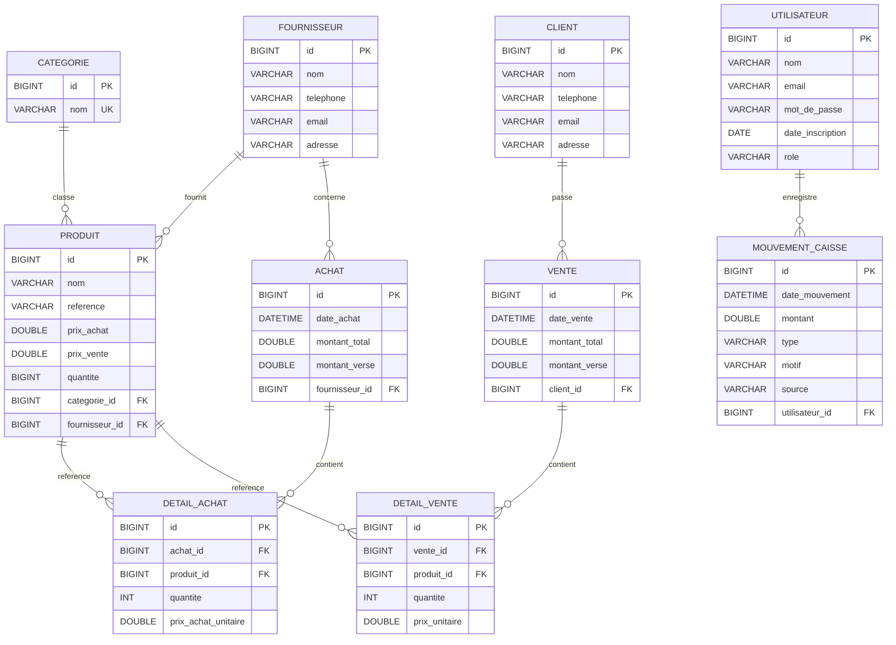

# Schema de Base de Donnees

Ce schema est reconstruit a partir des entites JPA du projet Spring Boot (`3.2.5`) et de la strategie de nommage par defaut en `snake_case`.

Base cible : `stock_pro`

## Tables

### `categorie`
- `id` PK
- `nom` UNIQUE

### `client`
- `id` PK
- `nom`
- `telephone`
- `email`
- `adresse`

### `fournisseur`
- `id` PK
- `nom`
- `telephone`
- `email`
- `adresse`

### `utilisateur`
- `id` PK
- `nom`
- `email`
- `mot_de_passe`
- `date_inscription`
- `role` valeurs attendues : `CAISSIER`, `ADMIN`

### `produit`
- `id` PK
- `nom`
- `reference`
- `prix_achat`
- `prix_vente`
- `quantite`
- `categorie_id` FK -> `categorie.id`
- `fournisseur_id` FK -> `fournisseur.id`

### `achat`
- `id` PK
- `date_achat`
- `montant_total`
- `montant_verse`
- `fournisseur_id` FK -> `fournisseur.id`

### `detail_achat`
- `id` PK
- `achat_id` FK -> `achat.id`
- `produit_id` FK -> `produit.id`
- `quantite`
- `prix_achat_unitaire`

### `vente`
- `id` PK
- `date_vente`
- `montant_total`
- `montant_verse`
- `client_id` FK -> `client.id`

### `detail_vente`
- `id` PK
- `vente_id` FK -> `vente.id`
- `produit_id` FK -> `produit.id`
- `quantite`
- `prix_unitaire`

### `mouvement_caisse`
- `id` PK
- `date_mouvement`
- `montant`
- `type`
- `motif`
- `source`
- `utilisateur_id` FK -> `utilisateur.id`

## Diagramme relationnel

## Source des tables

- `Achat.java`
- `Categorie.java`
- `Client.java`
- `DetailAchat.java`
- `DetailVente.java`
- `Fournisseur.java`
- `MouvementCaisse.java`
- `Produit.java`
- `Utilisateur.java`
- `Vente.java`

## Remarques

- Les proprietes calculees comme `getResteAPayer()` ne creent pas de colonne en base.
- Les annotations de validation comme `@NotBlank` et `@Email` expriment surtout des regles applicatives; elles ne sont pas toutes materialisees en contraintes SQL dans ce script.
- Les suppressions en cascade JPA ne signifient pas automatiquement `ON DELETE CASCADE` au niveau MySQL, donc ce script reste volontairement proche du mapping JPA.
