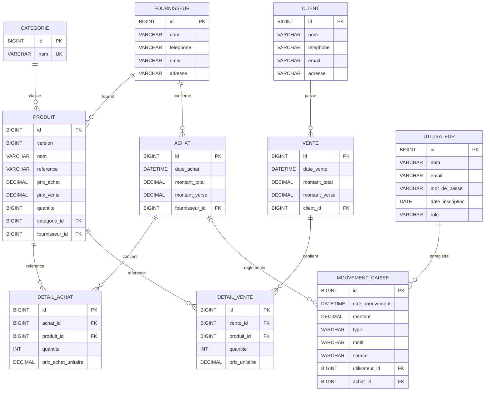

# Schema de Base de Donnees

Ce schema est reconstruit a partir des entites JPA du projet Spring Boot (`3.5.16`) et de la strategie de nommage par defaut en `snake_case`.

Base cible : `stock_pro`

## Tables

### `categorie`
- `id` PK
- `nom` UNIQUE

### `client`
- `id` PK
- `nom`
- `telephone`
- `email`
- `adresse`

### `fournisseur`
- `id` PK
- `nom`
- `telephone`
- `email`
- `adresse`

### `utilisateur`
- `id` PK
- `nom`
- `email`
- `mot_de_passe`
- `date_inscription`
- `role` valeurs attendues : `CAISSIER`, `ADMIN`

### `produit`
- `id` PK
- `version` BIGINT NOT NULL DEFAULT 0 : version JPA pour détecter les modifications concurrentes
- `nom`
- `reference`
- `prix_achat`
- `prix_vente`
- `quantite`
- `categorie_id` FK -> `categorie.id`
- `fournisseur_id` FK -> `fournisseur.id`

### `achat`
- `id` PK
- `date_achat`
- `montant_total`
- `montant_verse`
- `fournisseur_id` FK -> `fournisseur.id`

### `detail_achat`
- `id` PK
- `achat_id` FK -> `achat.id`
- `produit_id` FK -> `produit.id`
- `quantite`
- `prix_achat_unitaire`

### `vente`
- `id` PK
- `date_vente`
- `montant_total`
- `montant_verse`
- `client_id` FK -> `client.id`

### `detail_vente`
- `id` PK
- `vente_id` FK -> `vente.id`
- `produit_id` FK -> `produit.id`
- `quantite`
- `prix_unitaire`

### `mouvement_caisse`
- `id` PK
- `date_mouvement`
- `montant`
- `type`
- `motif`
- `source`
- `utilisateur_id` FK -> `utilisateur.id`
- `achat_id` FK optionnelle -> `achat.id`, pour les versements fournisseurs

## Diagramme relationnel


```mermaid
erDiagram
    CATEGORIE ||--o{ PRODUIT : classe
    FOURNISSEUR ||--o{ PRODUIT : fournit
    FOURNISSEUR ||--o{ ACHAT : concerne
    ACHAT ||--o{ DETAIL_ACHAT : contient
    PRODUIT ||--o{ DETAIL_ACHAT : reference
    CLIENT ||--o{ VENTE : passe
    VENTE ||--o{ DETAIL_VENTE : contient
    PRODUIT ||--o{ DETAIL_VENTE : reference
    UTILISATEUR ||--o{ MOUVEMENT_CAISSE : enregistre
    ACHAT o|--o{ MOUVEMENT_CAISSE : reglements

    CATEGORIE {
        BIGINT id PK
        VARCHAR nom UK
    }
    CLIENT {
        BIGINT id PK
        VARCHAR nom
        VARCHAR telephone
        VARCHAR email
        VARCHAR adresse
    }
    FOURNISSEUR {
        BIGINT id PK
        VARCHAR nom
        VARCHAR telephone
        VARCHAR email
        VARCHAR adresse
    }
    UTILISATEUR {
        BIGINT id PK
        VARCHAR nom
        VARCHAR email
        VARCHAR mot_de_passe
        DATE date_inscription
        VARCHAR role
    }
    PRODUIT {
        BIGINT id PK
        BIGINT version
        VARCHAR nom
        VARCHAR reference
        DECIMAL prix_achat
        DECIMAL prix_vente
        BIGINT quantite
        BIGINT categorie_id FK
        BIGINT fournisseur_id FK
    }
    ACHAT {
        BIGINT id PK
        DATETIME date_achat
        DECIMAL montant_total
        DECIMAL montant_verse
        BIGINT fournisseur_id FK
    }
    DETAIL_ACHAT {
        BIGINT id PK
        BIGINT achat_id FK
        BIGINT produit_id FK
        INT quantite
        DECIMAL prix_achat_unitaire
    }
    VENTE {
        BIGINT id PK
        DATETIME date_vente
        DECIMAL montant_total
        DECIMAL montant_verse
        BIGINT client_id FK
    }
    DETAIL_VENTE {
        BIGINT id PK
        BIGINT vente_id FK
        BIGINT produit_id FK
        INT quantite
        DECIMAL prix_unitaire
    }
    MOUVEMENT_CAISSE {
        BIGINT id PK
        DATETIME date_mouvement
        DECIMAL montant
        VARCHAR type
        VARCHAR motif
        VARCHAR source
        BIGINT utilisateur_id FK
        BIGINT achat_id FK
    }
```

## Source des tables

- `Achat.java`
- `Categorie.java`
- `Client.java`
- `DetailAchat.java`
- `DetailVente.java`
- `Fournisseur.java`
- `MouvementCaisse.java`
- `Produit.java`
- `Utilisateur.java`
- `Vente.java`

## Remarques

- Les proprietes calculees comme `getResteAPayer()` ne creent pas de colonne en base.
- Les annotations de validation comme `@NotBlank` et `@Email` expriment surtout des regles applicatives; elles ne sont pas toutes materialisees en contraintes SQL dans ce script.
- Les suppressions en cascade JPA ne signifient pas automatiquement `ON DELETE CASCADE` au niveau MySQL, donc ce script reste volontairement proche du mapping JPA.

## Mise à jour d'une base existante : version des produits

Le mapping `@Version` nécessite la colonne `produit.version`. Avec `spring.jpa.hibernate.ddl-auto=update`, Hibernate demande son ajout au prochain démarrage. Le défaut SQL `0` initialise les produits existants sans changer leur quantité.

Si le schéma est administré manuellement (`ddl-auto=none` ou `validate`), ajouter la colonne une seule fois, si elle est absente :

```sql
ALTER TABLE produit ADD COLUMN version BIGINT NOT NULL DEFAULT 0;
```

Le script `database-schema.sql` décrit les nouvelles bases ; son `CREATE TABLE IF NOT EXISTS` ne met pas à jour une table déjà existante. Cette migration MySQL n'a pas été exécutée pendant les tests, qui utilisent H2 en mémoire. Les formulaires de modification de produit ouverts avant la mise à jour doivent être rechargés.

## Mise à jour d'une base existante : règlements fournisseurs

Le lien optionnel `mouvement_caisse.achat_id` associe les nouveaux versements et les versements initiaux des nouveaux achats à leur facture. Avec `ddl-auto=update`, Hibernate demande l'ajout de cette colonne et de sa clé étrangère au prochain démarrage.

Pour un schéma administré manuellement, ajouter une seule fois la colonne et sa contrainte si elles sont absentes :

```sql
ALTER TABLE mouvement_caisse
    ADD COLUMN achat_id BIGINT NULL,
    ADD CONSTRAINT fk_mouvement_caisse_achat
        FOREIGN KEY (achat_id) REFERENCES achat (id);
```

Les anciens mouvements restent conservés avec `achat_id = NULL` ; aucune association n'est déduite de leur texte de motif. Le montant déjà payé des achats existants reste la référence pour leur dette. Leur historique de versements antérieur reste dans le journal général de caisse. Cette migration n'a pas été exécutée sur MySQL pendant les tests.

## Mise à jour d'une base existante : montants décimaux

Les neuf colonnes monétaires sont en `DECIMAL(17,2)` : prix d'achat et de vente des produits, totaux et versements des achats/ventes, prix unitaires des lignes et montant des mouvements de caisse. Les prix des produits sont obligatoires. Les colonnes de versement conservent les anciens `NULL`.

Le script de création ne convertit pas les tables existantes. Avant de démarrer l'application sur une ancienne base, suivre le [guide de migration](montants-et-migration.md), qui décrit l'arrêt des instances, la sauvegarde complète et les scripts avec contrôles et copies des tables. Un `bootRun` déjà lancé avec DevTools et `ddl-auto=update` peut demander cette conversion lors d'un rechargement automatique.
